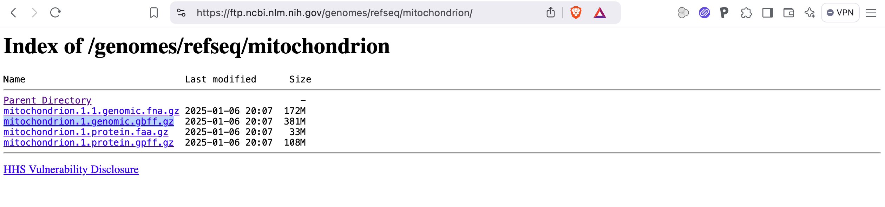

# Designing new barcodes with Ecoprimers

[`ecoPrimers`](http://metabarcoding.org/ecoprimers)  is a tool for designing new DNA metabarcodes. 
It is capable of working with a collection of mitochondrial genomes, chloroplast genomes or rRNA nuclear gene clusters. It is an alignment free method, which guarantees its efficiency.

The [`ecoPrimers`](http://metabarcoding.org/ecoprimers) were developed to be used in conjunction with the original OBITools. Therefore, using it with the new {} requires some special care in data preparation.

In this recipe we will use [`ecoPrimers`](http://metabarcoding.org/ecoprimers) to design a new bony fish DNA metabarcode.

## Getting [`ecoPrimers`](http://metabarcoding.org/ecoprimers)

[`ecoPrimers`(http://metabarcoding.org/ecoprimers) is available from the [Git metabarcoding](https://git.metabarcoding.org) site at

- https://git.metabarcoding.org/obitools/ecoprimers

Installation can be done by cloning the project

```bash
git clone https://git.metabarcoding.org/obitools/ecoprimers.git
```

This will create a new `ecoprimers` directory with a `src` subdirectory containing the source code.
You will need to change your current working directory to this `ecoprimers/src` directory.

```bash
cd ecoprimers/src
```

It's now possible to compile the ecoPrimers program using the make command

```bash
make
```

This command will produce a series of messages on your screen similar to the following. You may get some extra warning messages, but no errors should be reported. If compilation is successful, an `ecoPrimers` executable will be created in the current directory.

```
gcc -DMAC_OS_X -M  -o ecoprimer.d ecoprimer.c
gcc -DMAC_OS_X -W -Wall -m64 -g -c -o ecoprimer.o ecoprimer.c
/Library/Developer/CommandLineTools/usr/bin/make -C libecoPCR
gcc -DMAC_OS_X -M  -o econame.d econame.c
gcc -DMAC_OS_X -M  -o ecofilter.d ecofilter.c
gcc -DMAC_OS_X -M  -o ecotax.d ecotax.c
gcc -DMAC_OS_X -M  -o ecoseq.d ecoseq.c
gcc -DMAC_OS_X -M  -o ecorank.d ecorank.c
gcc -DMAC_OS_X -M  -o ecoMalloc.d ecoMalloc.c
gcc -DMAC_OS_X -M  -o ecoIOUtils.d ecoIOUtils.c
gcc -DMAC_OS_X -M  -o ecoError.d ecoError.c
gcc -DMAC_OS_X -M  -o ecodna.d ecodna.c
gcc -DMAC_OS_X -W -Wall -m64 -g -c -o ecodna.o ecodna.c
gcc -DMAC_OS_X -W -Wall -m64 -g -c -o ecoError.o ecoError.c
gcc -DMAC_OS_X -W -Wall -m64 -g -c -o ecoIOUtils.o ecoIOUtils.c
gcc -DMAC_OS_X -W -Wall -m64 -g -c -o ecoMalloc.o ecoMalloc.c
gcc -DMAC_OS_X -W -Wall -m64 -g -c -o ecorank.o ecorank.c
gcc -DMAC_OS_X -W -Wall -m64 -g -c -o ecoseq.o ecoseq.c
gcc -DMAC_OS_X -W -Wall -m64 -g -c -o ecotax.o ecotax.c
gcc -DMAC_OS_X -W -Wall -m64 -g -c -o ecofilter.o ecofilter.c
gcc -DMAC_OS_X -W -Wall -m64 -g -c -o econame.o econame.c
ar -cr libecoPCR.a ecodna.o ecoError.o ecoIOUtils.o ecoMalloc.o ecorank.o ecoseq.o ecotax.o ecofilter.o econame.o
ranlib libecoPCR.a
/Library/Developer/CommandLineTools/usr/bin/make -C libecoprimer
gcc -DMAC_OS_X -M  -o ahocorasick.d ahocorasick.c
gcc -DMAC_OS_X -M  -o PrimerSets.d PrimerSets.c
gcc -DMAC_OS_X -M  -o filtering.d filtering.c
gcc -DMAC_OS_X -M  -o apat_search.d apat_search.c
gcc -DMAC_OS_X -M  -o taxstats.d taxstats.c
gcc -DMAC_OS_X -M  -o pairs.d pairs.c
gcc -DMAC_OS_X -M  -o pairtree.d pairtree.c
gcc -DMAC_OS_X -M  -o sortmatch.d sortmatch.c
gcc -DMAC_OS_X -M  -o libstki.d libstki.c
gcc -DMAC_OS_X -M  -o queue.d queue.c
gcc -DMAC_OS_X -M  -o merge.d merge.c
gcc -DMAC_OS_X -M  -o aproxpattern.d aproxpattern.c
gcc -DMAC_OS_X -M  -o strictprimers.d strictprimers.c
gcc -DMAC_OS_X -M  -o hashsequence.d hashsequence.c
gcc -DMAC_OS_X -M  -o sortword.d sortword.c
gcc -DMAC_OS_X -M  -o smothsort.d smothsort.c
gcc -DMAC_OS_X -M  -o readdnadb.d readdnadb.c
gcc -DMAC_OS_X -M  -o goodtaxon.d goodtaxon.c
gcc -DMAC_OS_X -W -Wall -m64 -g -c -o goodtaxon.o goodtaxon.c
gcc -DMAC_OS_X -W -Wall -m64 -g -c -o readdnadb.o readdnadb.c
gcc -DMAC_OS_X -W -Wall -m64 -g -c -o smothsort.o smothsort.c
gcc -DMAC_OS_X -W -Wall -m64 -g -c -o sortword.o sortword.c
gcc -DMAC_OS_X -W -Wall -m64 -g -c -o hashsequence.o hashsequence.c
gcc -DMAC_OS_X -W -Wall -m64 -g -c -o strictprimers.o strictprimers.c
gcc -DMAC_OS_X -W -Wall -m64 -g -c -o aproxpattern.o aproxpattern.c
gcc -DMAC_OS_X -W -Wall -m64 -g -c -o merge.o merge.c
gcc -DMAC_OS_X -W -Wall -m64 -g -c -o queue.o queue.c
gcc -DMAC_OS_X -W -Wall -m64 -g -c -o libstki.o libstki.c
gcc -DMAC_OS_X -W -Wall -m64 -g -c -o sortmatch.o sortmatch.c
gcc -DMAC_OS_X -W -Wall -m64 -g -c -o pairtree.o pairtree.c
gcc -DMAC_OS_X -W -Wall -m64 -g -c -o pairs.o pairs.c
gcc -DMAC_OS_X -W -Wall -m64 -g -c -o taxstats.o taxstats.c
gcc -DMAC_OS_X -W -Wall -m64 -g -c -o apat_search.o apat_search.c
gcc -DMAC_OS_X -W -Wall -m64 -g -c -o filtering.o filtering.c
gcc -DMAC_OS_X -W -Wall -m64 -g -c -o PrimerSets.o PrimerSets.c
gcc -DMAC_OS_X -W -Wall -m64 -g -c -o ahocorasick.o ahocorasick.c
ar -cr libecoprimer.a goodtaxon.o readdnadb.o smothsort.o sortword.o hashsequence.o strictprimers.o aproxpattern.o merge.o queue.o libstki.o sortmatch.o pairtree.o pairs.o taxstats.o apat_search.o filtering.o PrimerSets.o ahocorasick.o
ranlib libecoprimer.a
/Library/Developer/CommandLineTools/usr/bin/make -C libthermo
gcc -DMAC_OS_X -M  -o thermostats.d thermostats.c
gcc -DMAC_OS_X -M  -o nnparams.d nnparams.c
gcc -DMAC_OS_X -W -Wall -m64 -g -c -o nnparams.o nnparams.c
gcc -DMAC_OS_X -W -Wall -m64 -g -c -o thermostats.o thermostats.c
ar -cr libthermo.a nnparams.o thermostats.o
ranlib libthermo.a
gcc -g  -O5 -m64 -o ecoPrimers ecoprimer.o -LlibecoPCR -Llibecoprimer -Llibthermo -L/usr/local/lib -lecoprimer -lecoPCR -lthermo -lz -lm 
```

You can now copy the `ecoPrimers' executable to a directory that is part of your PATH environment variable.
You can use the following command to list all these directories. On my computer the result is

```bash
for p in $path; do echo $p; done | sort -u
```
```
/Users/coissac/bin
/Users/coissac/go/bin
/bin
/opt/X11/bin
/sbin
/usr/bin
/usr/local/bin
/usr/local/go/bin
/usr/sbin
```

From this list you can choose the directory where you want to install the `ecoPrimers' executable.
`/Users/coissac/bin` can be a good choice, as it is in the path of my home directory, and therefore does not require root privileges to copy the `ecoPrimers` executable into. `/usr/local/bin` is also a good choice, as it is the default directory for installing non-standard software on a UNIX system. When software is installed in `/usr/local/bin`, it is available to all users of the system. However, copying the `ecoPrimers` executable to `/usr/local/bin` requires root privileges.

To install the software for myself without root privileges:

```bash
cp ecoPrimers /Users/coissac/bin
```

To install the software for all users on the system, but with root privileges:

```bash
sudo cp ecoPrimers /usr/local/bin
``` 

## Preparing the data

### What do we need ?

To design a new animal DNA metabarcode we download from the NCBI the following data

-   The complete set of whole mitochondrial genomes
-   The NCBI taxonomy

#### Downloading the mitochondrial genomes

The file containing the complete set of mitochondrial genomes can be downloaded using your favourite web browser from the [NCBI FTP website](https://ftp.ncbi.nlm.nih.gov/genomes/refseq/mitochondrion).

{fig-align="center"}

You will need to download the Genbank flat file format of the data. The file with the extension `gbff.gz`. This is the only one that contains the link to the NCBI taxonomy for each sequence.

If you need to download the data on a UNIX computer, you may not have access to a web browser on that system. In this case, you can use the `curl` command line tool to download the file. The `curl` command line tool is available on most UNIX systems and allows you to download files from the Internet by knowing their URL. 

```bash
curl 'https://ftp.ncbi.nlm.nih.gov/genomes/refseq/mitochondrion/mitochondrion.1.genomic.gbff.gz' \
     > mito.all.gb.gz
```

Because the file is compressed, you must use the `zless` command instead of the classic `less` command to inspect the file without decompressing it first. 

```bash
zless mito.all.gb.gz
```

```
LOCUS       NW_009243181           45189 bp    DNA     linear   CON 06-OCT-2014
DEFINITION  Fonticula alba strain ATCC 38817 mitochondrial scaffold
            supercont2.211, whole genome shotgun sequence.
ACCESSION   NW_009243181 NZ_AROH01000000
VERSION     NW_009243181.1
DBLINK      BioProject: PRJNA262900
            Assembly: GCF_000388065.1
KEYWORDS    WGS; RefSeq.
SOURCE      mitochondrion Fonticula alba
  ORGANISM  Fonticula alba
            Eukaryota; Rotosphaerida; Fonticulaceae; Fonticula.
REFERENCE   1  (bases 1 to 45189)
  AUTHORS   Russ,C., Cuomo,C., Burger,G., Gray,M.W., Holland,P.W.H., King,N.,
            Lang,F.B.F., Roger,A.J., Ruiz-Trillo,I., Brown,M., Walker,B.,
            Young,S., Zeng,Q., Gargeya,S., Fitzgerald,M., Haas,B.,
            Abouelleil,A., Allen,A.W., Alvarado,L., Arachchi,H.M., Berlin,A.M.,
            Chapman,S.B., Gainer-Dewar,J., Goldberg,J., Griggs,A., Gujja,S.,
            Hansen,M., Howarth,C., Imamovic,A., Ireland,A., Larimer,J.,
            McCowan,C., Murphy,C., Pearson,M., Poon,T.W., Priest,M.,
            Roberts,A., Saif,S., Shea,T., Sisk,P., Sykes,S., Wortman,J.,
            Nusbaum,C. and Birren,B.
  CONSRTM   The Broad Institute Genomics Platform
  TITLE     The Genome Sequence of Fonticula alba ATCC 38817
  JOURNAL   Unpublished
REFERENCE   2  (bases 1 to 45189)
  CONSRTM   NCBI Genome Project
  TITLE     Direct Submission
  JOURNAL   Submitted (06-OCT-2014) National Center for Biotechnology
            Information, NIH, Bethesda, MD 20894, USA
REFERENCE   3  (bases 1 to 45189)
  AUTHORS   Russ,C., Cuomo,C., Burger,G., Gray,M.W., Holland,P.W.H., King,N.,
            Lang,F.B.F., Roger,A.J., Ruiz-Trillo,I., Brown,M., Walker,B.,
            Young,S., Zeng,Q., Gargeya,S., Fitzgerald,M., Haas,B.,
            Abouelleil,A., Allen,A.W., Alvarado,L., Arachchi,H.M., Berlin,A.M.,
            Chapman,S.B., Gainer-Dewar,J., Goldberg,J., Griggs,A., Gujja,S.,
            Hansen,M., Howarth,C., Imamovic,A., Ireland,A., Larimer,J.,
            McCowan,C., Murphy,C., Pearson,M., Poon,T.W., Priest,M.,
            Roberts,A., Saif,S., Shea,T., Sisk,P., Sykes,S., Wortman,J.,
            Nusbaum,C. and Birren,B.
  CONSRTM   The Broad Institute Genomics Platform
  TITLE     Direct Submission
  JOURNAL   Submitted (26-APR-2013) Broad Institute of MIT and Harvard, 7
            Cambridge Center, Cambridge, MA 02142, USA
COMMENT     PROVISIONAL REFSEQ: This record has not yet been subject to final
            NCBI review. The reference sequence is identical to KB932304.
            
            ##Genome-Assembly-Data-START##
            Assembly Method       :: ALLPATHS v. R44024; Mito ALLPATHS v.
                                     R43919
            Assembly Name         :: Font_alba_ATCC_38817_V2
            Genome Coverage       :: 317.0x; Mito 63.0x
            Sequencing Technology :: Illumina
            ##Genome-Assembly-Data-END##
FEATURES             Location/Qualifiers
     source          1..45189
                     /organism="Fonticula alba"
                     /organelle="mitochondrion"
                     /mol_type="genomic DNA"
                     /strain="ATCC 38817"
                     /isolation_source="dog dung"
                     /culture_collection="ATCC:38817"
                     /db_xref="taxon:691883"
                     /geo_loc_name="USA: Grainfield, Kansas"
                     /collection_date="1960"
```

At the end of the top of the file shown above, we can see the `/db_xref="taxon:691883"` field, which provides the link to the NCBI taxonomy for this first entry in the file.


#### Download the full taxonomy

The NCBI taxonomy is available as a [tarball](https://ftp.ncbi.nlm.nih.gov/pub/taxonomy/taxdump.tar.gz) file. It can be downloaded in the same way as the RefSeq mitochondrial database. You can also download the NCBI taxonomy using the  command with the `--download-ncbi` option.

```bash
obitaxonomy --download-ncbi
```
```
INFO[0000] Number of workers set 16                     
INFO[0000] Downloading NCBI Taxdump to ncbitaxo_20250211.tgz 
downloading 100% ████████████████████████████████████████| (66/66 MB, 5.1 MB/s)   
```

By default, the  downloads the latest version of the NCBI taxonomy available from the NCBI FTP site and saves it to the current directory in a file named `ncbitaxo_YYYYMMDD.tgz` where `YYYY` is the year, `MM` is the month and `DD` is the day of the download. Here the date is 2025/02/11, so the filename is `ncbitaxo_20250211.tgz`.

You can also specify the filename of the downloaded file using the `--out filename` option. For example

```bash
obitaxonomy --download-ncbi --out ncbitaxo.tgz
```

##### The archive contains several files

The NCBI taxonomy dump file contains all the relationships between taxa.
This information is stored in two files: `nodes.dmp` and `names.dmp`.


- file: nodes.dmp

  This file contains the taxonomic hierarchy of the NCBI taxonomy. It is a tabular file 
  where the columns are separated by a `|` character and some whitespace. 

  - The first column is the taxid of the taxon. 
  - The second column is the parent taxid of the taxon.
  - The third column is the taxonomic rank of the taxon. 

  The remaining columns are not used by the {}.

```
1  |  1  |  no rank  |		|	8	|	0	| ...
2	|	131567	|	superkingdom	|		|	0	|	0	|
6	|	335928	|	genus	|		|	0	|	1	|
7	|	6	|	species	|	AC	|	0	|	1	|
9	|	32199	|	species	|	BA	|	0	|
10	|	135621	|	genus	|		|	0	|
11	|	1707	|	species	|	CG	|	0	|	1	|
13	|	203488	|	genus	|		|	0	|	1	|
14	|	13	|	species	|	DT	|	0	|	1	|
```

- file: `names.dmp`

  This file contains the scientific names, and a set of alternative names, for all the taxa. It is also a tabular file where the columns are separated by a `|` character and some whitespace. 

  - The first column is the taxid of the taxon. 
  - The second column is the name of the taxon. 
  - The third column is the class name of this name (*e.g* scientific name, or blast name...) 

```
1	|	root	|		|	scientific name	|
2	|	Bacteria	|	Bacteria <prokaryote>	|	scientific name	|
2	|	Monera	|	Monera <Bacteria>	|	in-part	|
2	|	Procaryotae	|	Procaryotae <Bacteria>	|	in-part	|
2	|	Prokaryota	|	Prokaryota <Bacteria>	|	in-part	|
2	|	Prokaryotae	|	Prokaryotae <Bacteria>	|	in-part	|
2	|	bacteria	|	bacteria <blast2>	|	blast name	|
2	|	eubacteria	|		|	genbank common name	|
2	|	prokaryote	|	prokaryote <Bacteria>	|	in-part	|
...
10	|	Cellvibrio	|		|	scientific name	|
11	|	[Cellvibrio] gilvus	|		|	scientific name	|
13	|	Dictyoglomus	|		|	scientific name	|
14	|	Dictyoglomus thermophilum	|		|	scientific name	|
```

The archive contains a `readme.txt` file that contains information about all the files present in the archive.
Please read it to get the full information about the NCBI taxonomy dump file.

## Preparing the set of complete genomes

With {}, the favorite format for storing sequences is the {} format. Therefore, we will use the  tool to convert the genbank files to the {} format. 

```bash
obiconvert --skip-empty \
           --update-taxid \
           -t ncbitaxo_20250211.tgz \
           mito.all.gb.gz \
       > mito.all.fasta
head -5 mito.all.fasta
```

It is not equivalent downloading directly the fasta formatted file from the NCBI FTP site and downloading the Genbank format, then converting it to the {} format using . Only in the later case, the {} formated file will contain the taxid of the taxon. 

Below is presented the five first lines of the new `mito.all.fasta` file

```
>NC_072933 {"definition":"Echinosophora koreensis mitochondrion, complete genome.","scientific_name":"mitochondrion Echinosophora koreensis","taxid":228658}
ctttcgggtcggaaatagaagatctggattagatcccttctcgatagctttagtcagagc
tcatccctcgaaaaagggagtagtgagatgagaaaagggtgactagaatacggaaattca
actagtgaagtcagatccgggaattccactattgaagttatccgtcttaggcttcaagca
agctatctttcaaggaagtcagtctaagccctaagccaagatctgctttttgccagtcaa
```

## Preparing a database for new barcode inference

Three steps are necessary to prepare the database well for new barcode inference.

- Annotate the sequences by their species `taxid`.
- Make sure that no species is represented much more than the others.
- Extract only vertebrate genomes.

### Searching for the taxid of vertebrates.

First we will search for the taxid of *Vertebrata*, as the taxid is the only way to pass taxonomic information to the {}. The `--fixed` option asks for exact matches of the name. The name search is not case-sensitive. 

```bash
obitaxonomy -t ncbitaxo_20250211.tgz \
              --fixed \
              'vertebrata'
```
```csv
taxid,parent,taxonomic_rank,scientific_name
taxon:1261581 [Vertebrata]@genus,taxon:2008651 [Polysiphonioideae]@subfamily,genus,Vertebrata
taxon:7742 [Vertebrata]@clade,taxon:89593 [Craniata]@subphylum,clade,Vertebrata
```

To make the CSV output easier to read, we will use the `csvlook` tool, which displays the CSV file as a nice table. 

```bash
obitaxonomy -t ncbitaxo_20250211.tgz \
              --fixed \
              'vertebrata' \
    | csvlook
```
```csv
| taxid                            | parent                                      | taxonomic_rank | scientific_name |
| -------------------------------- | ------------------------------------------- | -------------- | --------------- |
| taxon:1261581 [Vertebrata]@genus | taxon:2008651 [Polysiphonioideae]@subfamily | genus          | Vertebrata      |
| taxon:7742 [Vertebrata]@clade    | taxon:89593 [Craniata]@subphylum            | clade          | Vertebrata      |
```

Surprisingly, the Latin name *Vertebrata* is shared by two different taxa. The first is a genus and obviously not the one we are looking for. The second is a clade, and it is the one we are looking for. 

#### Looking for the *Vertebrata* genus Taxid

Just out of curiosity, we are going to search for the taxonomic path *Vertebrata* genus taxid. 


```bash
obitaxonomy -t ncbitaxo_20250211.tgz \
              -p 2008651 \
      | csvlook
```
```csv
| taxid                                       | parent                                      | taxonomic_rank | scientific_name    |
| ------------------------------------------- | ------------------------------------------- | -------------- | ------------------ |
| taxon:2008651 [Polysiphonioideae]@subfamily | taxon:2803 [Rhodomelaceae]@family           | subfamily      | Polysiphonioideae  |
| taxon:2803 [Rhodomelaceae]@family           | taxon:2802 [Ceramiales]@order               | family         | Rhodomelaceae      |
| taxon:2802 [Ceramiales]@order               | taxon:2045261 [Rhodymeniophycidae]@subclass | order          | Ceramiales         |
| taxon:2045261 [Rhodymeniophycidae]@subclass | taxon:2806 [Florideophyceae]@class          | subclass       | Rhodymeniophycidae |
| taxon:2806 [Florideophyceae]@class          | taxon:2763 [Rhodophyta]@phylum              | class          | Florideophyceae    |
| taxon:2763 [Rhodophyta]@phylum              | taxon:2759 [Eukaryota]@superkingdom         | phylum         | Rhodophyta         |
| taxon:2759 [Eukaryota]@superkingdom         | taxon:131567 [cellular organisms]@no rank   | superkingdom   | Eukaryota          |
| taxon:131567 [cellular organisms]@no rank   | taxon:1 [root]@no rank                      | no rank        | cellular organisms |
| taxon:1 [root]@no rank                      | taxon:1 [root]@no rank                      | no rank        | root               |
```

You can see that *Vertebrata* genus belongs to the *Rhodophyta* phylum, which corresponds to red algae. 


### Re-annotation of sequences to species level and selection of genomes

In order to know how species are represented in the database, and more specifically how many sequences represent each species, we will annotate the sequences with taxonomic information at the species level. We need to do this because some mitochondrial genomes can be annotated at other taxonomic levels, such as subspecies.

 can perform this task using the `--with-taxon-at-rank` option. This option requires you to specify the taxonomic rank at which the annotation should be performed. In our case we will use the rank `species'. The species taxid is stored in the `species_taxid` tag of the sequence.

In the following command we combine three  commands with one  command using the `|` pipe operator. 

```bash
obiannotate -t ncbitaxo_20250211.tgz \
            --with-taxon-at-rank species \
            mito.all.fasta | \
  obiannotate -S 'ori_taxid=annotations.taxid' | \
  obiannotate -S 'taxid=annotations.species_taxid' | \
  obiuniq -c taxid > mito.one.fasta
```

Looking at the sequence of NC_050066, it is annotated with taxon 2756270, which corresponds to the subspecies *Monochamus alternatus alternatus*:

```
>NC_050066 {"definition":"Monochamus alternatus alternatus mitochondrion, complete genome.","scientific_name":"mitochondrion Monochamus alternatus alternatus","taxid":"taxon:2756270 [Monochamus alternatus alternatus]@subspecies"}
aatgaagtgcctgagcaaagggtaattttgatagaattagtaacgtgaattttcaccttc
attaattatatttaatagaattaaactatttccttagatatcaaaaatctttatacatca
...
```

The first  command adds the `species_taxid` tag to the sequences. 

```
>NC_050066 {"definition":"Monochamus alternatus alternatus mitochondrion, complete genome.","scientific_name":"mitochondrion Monochamus alternatus alternatus","species_name":"Monochamus alternatus","species_taxid":"taxon:192382 [Monochamus alternatus]@species","taxid":"taxon:2756270 [Monochamus alternatus alternatus]@subspecies"}
aatgaagtgcctgagcaaagggtaattttgatagaattagtaacgtgaattttcaccttc
attaattatatttaatagaattaaactatttccttagatatcaaaaatctttatacatca
...
```

The second  copies the original `taxid` tag into a new tag named `ori_taxid` to preserve the original taxid for possible future use. 

```
>NC_050066 {"definition":"Monochamus alternatus alternatus mitochondrion, complete genome.","ori_taxid":"taxon:2756270 [Monochamus alternatus alternatus]@subspecies","scientific_name":"mitochondrion Monochamus alternatus alternatus","species_name":"Monochamus alternatus","species_taxid":"taxon:192382 [Monochamus alternatus]@species","taxid":"taxon:2756270 [Monochamus alternatus alternatus]@subspecies"}
aatgaagtgcctgagcaaagggtaattttgatagaattagtaacgtgaattttcaccttc
attaattatatttaatagaattaaactatttccttagatatcaaaaatctttatacatca
...
```

The third  then copies the `species_taxid` tag into the main `taxid` tag. 
From now on, the {} will use the species taxid stored in the `taxid` tag as the taxonomic annotation for the sequence. 

```
>NC_050066 {"definition":"Monochamus alternatus alternatus mitochondrion, complete genome.","ori_taxid":"taxon:2756270 [Monochamus alternatus alternatus]@subspecies","scientific_name":"mitochondrion Monochamus alternatus alternatus","species_name":"Monochamus alternatus","species_taxid":"taxon:192382 [Monochamus alternatus]@species","taxid":"taxon:192382 [Monochamus alternatus]@species"}
aatgaagtgcctgagcaaagggtaattttgatagaattagtaacgtgaattttcaccttc
attaattatatttaatagaattaaactatttccttagatatcaaaaatctttatacatca
...
```

Look carefully at this latest version of the sequence. The `taxid` tag has been updated to the species taxid, the `ori_taxid` tag contains the original taxid as provided by Genbank, and the `species_taxid` tag also contains the species taxid. 

The last  merges in a single sequence entry all the sequences strictly identical. Here the `-c taxid` option ensures that only sequences with the same taxid are merged. Therefore, two strictly identical sequences not annotated with the same taxid will be kept as two sequence entries. 

### Look at the evenness of the Species representation

Our goal here is to do a histogram of the number of sequences per species with the help of UNIX commands. 
More specifically, how many species are represented by one, two, three or more sequences. 

The last command we will run is the following:

```bash
obicsv -k taxid mito.one.fasta \
     | tail -n +2 \
     | sort \
     | uniq -c \
     | sort -nk1 \
     | cut -w -f 2 \
     | uplot count
```

But first, try to understand what is going on. 

 converts a sequence file into a CSV file. Here because of the `-k taxid` option, the CSV file will only contain the `taxid` tag for every sequence. The `head` command is head to only display the top ten first lines of the result.

```bash
obicsv -k taxid mito.one.fasta \
     | head
```
```
taxid
taxon:2065826 [Sineleotris saccharae]@species
taxon:2219250 [Ocinara albicollis]@species
taxon:8306 [Ambystoma talpoideum]@species
taxon:80600 [Rhizopogon vinicolor]@species
taxon:270463 [Vanessa indica]@species
taxon:1028098 [Hierodula patellifera]@species
taxon:56258 [Sagittarius serpentarius]@species
taxon:457650 [Myadora brevis]@species
taxon:763200 [Arma chinensis]@species
```

The `tail` command is used to remove the header line from the CSV file, to keep only the data part of the file.
It is done by extracting the tail, the end of the file, from its second line (option `-n +2`).

```bash
obicsv -k taxid mito.one.fasta \
     | tail -n +2 \
     | head
```
```
taxon:2065826 [Sineleotris saccharae]@species
taxon:2219250 [Ocinara albicollis]@species
taxon:8306 [Ambystoma talpoideum]@species
taxon:80600 [Rhizopogon vinicolor]@species
taxon:270463 [Vanessa indica]@species
taxon:1028098 [Hierodula patellifera]@species
taxon:56258 [Sagittarius serpentarius]@species
taxon:457650 [Myadora brevis]@species
taxon:763200 [Arma chinensis]@species
taxon:2060314 [Neotrygon indica]@species
```

As you can see, the first line of the output does not contain the `taxid` column name header present in the previous output. 

In the next command, the `sort` command is used to sort the line to put identical `taxid` values in a row. 

```bash
obicsv -k taxid mito.one.fasta \
     | tail -n +2 \
     | sort \
     | head
```
```
"taxon:1030158 [Ficus variegata Roding, 1798]@species"
"taxon:244488 [Pillucina pisidium (Dunker, 1860)]@species"
"taxon:352057 [Anopheles albitarsis F Brochero et al., 2007]@species"
"taxon:646521 [Contracaecum rudolphii B Bullini et al., 1986]@species"
"taxon:908352 [Anopheles albitarsis G Krzywinski et al., 2011]@species"
taxon:1000982 [Steindachneridion melanodermatum]@species
taxon:1001283 [Calameuta idolon]@species
taxon:1001291 [Trachelus tabidus]@species
taxon:1001332 [Phylloporia weberiana]@species
taxon:1001553 [Dephomys defua]@species
```

We can then add the `uniq -c` command to count the number of times each `taxid` appears in the file. 

```bash
obicsv -k taxid mito.one.fasta \
     | tail -n +2 \
     | sort \
     | uniq -c \
     | head
```
```
   1 "taxon:1030158 [Ficus variegata Roding, 1798]@species"
   1 "taxon:244488 [Pillucina pisidium (Dunker, 1860)]@species"
   1 "taxon:352057 [Anopheles albitarsis F Brochero et al., 2007]@species"
   1 "taxon:646521 [Contracaecum rudolphii B Bullini et al., 1986]@species"
   1 "taxon:908352 [Anopheles albitarsis G Krzywinski et al., 2011]@species"
   1 taxon:1000982 [Steindachneridion melanodermatum]@species
   1 taxon:1001283 [Calameuta idolon]@species
   1 taxon:1001291 [Trachelus tabidus]@species
   1 taxon:1001332 [Phylloporia weberiana]@species
   1 taxon:1001553 [Dephomys defua]@species
```

The `uniq` command added the first column to the output, which is the number of times each `taxid` appears in the original file. 

Next step is to remove the `taxid` column from the output and keep only the `count` first column.
Because the `uniq` command adds a space between before the count column, the cut command will consider it as the second column despite for us it looks like the first column.

```bash
obicsv -k taxid mito.one.fasta \
     | tail -n +2 \
     | sort \
     | uniq -c \
     | cut -w -f 2 \
     | head
```
```
1
1
1
1
1
1
1
1
1
1
```

- The `-w` is used to specify that the column separator is the space character. 
- The `-f 2` is used to specify that the second column is the one to be cut.

The last step is to send this output to the `uplot` command to plot the histogram. 

```bash
obicsv -k taxid mito.one.fasta \
     | tail -n +2 \
     | sort \
     | uniq -c \
     | sort -nk1 \
     | cut -w -f 2 \
     | uplot count
```
```
     ┌                                        ┐ 
   1 ┤■■■■■■■■■■■■■■■■■■■■■■■■■■■■■■■ 17769.0   
   2 ┤ 90.0                                     
   3 ┤ 17.0                                     
   4 ┤ 5.0                                      
   5 ┤ 4.0                                      
   6 ┤ 2.0                                      
   7 ┤ 1.0                                      
     └                                        ┘ 
```

As you can see, very few taxa are represented by more than one mitochondrial genome, while 17769 species are represented by a single genome. Here we can assume that the mitochondrial genomes are not too much biased in favour of a particular taxon.


### Selection of *vertebrate* genomes

The mitochondrial database we have downloaded contains mitochondrial genomes from vertebrates, but also from invertebrates, fungi, plants... Since the `ecoPrimers` require that potentially all sequences provided in the learning database can contain the barcode we are looking for, we will restrict the learning database to contain only vertebrate genomes. 

 command will do this for us. We just need to provide the `taxid` of the `vertebrata` taxon use as the `-r` option, and the taxonomy using the `-t` option. 

```bash
obigrep -t ncbitaxo_20250211.tgz \
        -r 7742 \
        mito.one.fasta > mito.vert.fasta
```

Now we can count the number of sequences in the new learning database.

```bash
obicount mito.vert.fasta \
   | csvlook
```
```
| entities |           n |
| -------- | ----------- |
| variants |       7,822 |
| reads    |       7,823 |
| symbols  | 131,378,756 |
```

### Formatting data for `ecoPrimers`

As mentioned in the introduction, the `ecoPrimers` have been designed to work with the original version of OBITools. 
We now need to perform three more steps to prepare the data for the `ecoPrimers`.

#### Unarchiving the taxonomy

The old OBITools cannot use archived and compressed taxonomies. So we need to

- Create a new directory to store the unarchived taxonomy using the `mkdir` command.
- Change to the new directory using the `cd' command.
- Extract the taxonomy from the compressed file using the `tar` command.
- Return to the original directory using the `cd' command.

```bash
mkdir ncbitaxo_20250211
cd ncbitaxo_20250211
tar zxvf ../ncbitaxo_20250211.tgz 
cd ..
```

#### Converting the database to the old obitools format

Now {} are storing annotation using the JSON format. 

```
>NC_050066 {"definition":"Monochamus alternatus alternatus mitochondrion, complete genome.","ori_taxid":"taxon:2756270 [Monochamus alternatus alternatus]@subspecies","scientific_name":"mitochondrion Monochamus alternatus alternatus","species_name":"Monochamus alternatus","species_taxid":"taxon:192382 [Monochamus alternatus]@species","taxid":"taxon:192382 [Monochamus alternatus]@species"}
aatgaagtgcctgagcaaagggtaattttgatagaattagtaacgtgaattttcaccttc
attaattatatttaatagaattaaactatttccttagatatcaaaaatctttatacatca
...
```

When the original OBITools stored annotation a `key=value;` format.

```
>NC_050066 ori_taxid=taxon:2756270 [Monochamus alternatus alternatus]@subspecies; scientific_name=mitochondrion Monochamus alternatus alternatus; species_name=Monochamus alternatus; species_taxid=taxon:192382 [Monochamus alternatus]@species; taxid=taxon:192382 [Monochamus alternatus]@species; count=1;  Monochamus alternatus alternatus mitochondrion, complete genome.
aatgaagtgcctgagcaaagggtaattttgatagaattagtaacgtgaattttcaccttc
attaattatatttaatagaattaaactatttccttagatatcaaaaatctttatacatca
...
```

When option `-O` is added to an {} command, the old OBITools format is used instead of the JSON format.

```bash
obiconvert -O mito.vert.fasta > mito.vert.old.fasta
```

```bash
head -5 mito.vert.old.fasta
```
```csv
>NC_071784 taxid=taxon:2065826 [Sineleotris saccharae]@species; count=1; ori_taxid=taxon:2065826 [Sineleotris saccharae]@species; scientific_name=mitochondrion Sineleotris saccharae; species_name=Sineleotris saccharae; species_taxid=taxon:2065826 [Sineleotris saccharae]@species;  Sineleotris saccharae mitochondrion, complete genome.
gctagcgtagcttaaccaaagcataacactgaagatgttaagatgggccctagaaagccc
cgcaagcacaaaagcttggtcctggctttactatcagcttaggctaaacttacacatgca
agtatccgcatccccgtgagaatgcccttaagctcccaccgctaacaggagtcaaggagc
cggtatcaggcacaaccctgagttagcccacgacaccttgctcagccacacccccaaggg
```

### Indexing the mitochondrial learning database

The last step for preparing the data for the `ecoPrimers` is to index the learning database. 
This job was done by the original OBITools, but the new {} do not. 

Using the <a href="ecoPCRFormat" download="ecoPCRFormat">`ecoPCRFormat`</a> python script, you can do that indexing without the need of the original OBITools.

Once you have downloaded the `ecoPCRFormat` python script by clicking <a href="ecoPCRFormat" download="ecoPCRFormat">`here`</a>, you have to make it executable and to copy it to the same directory as the `ecoPrimers` program.

Here, an example of how to do that:

```bash
curl http://localhost:1313/obitools4-doc/docs/cookbook/ecoprimers/ecoPCRFormat > ecoPCRFormat
chmod +x ecoPCRFormat
cp ecoPCRFormat /Users/coissac/bin
```

You can now run the `ecoPCRFormat` script to create the index files.

```bash
ecoPCRFormat -t ncbitaxo_20250211 \
             -f \
             -n vertebrata \
             mito.vert.old.fasta
```

- `-t`option specifies the directory where the taxonomy database is located.
- `-f` option specifies that the input file is in fasta format.
- `-n` option specifies the name of the indexed learning database.
- The last parameter `mito.vert.old.fasta` is the name of the input file containing the sequences to be indexed.

That command will create the following index files:

```bash
ls -l vertebrata*
```
```
-rw-r--r--@ 1 coissac  staff  260899785 Feb 11 11:53 vertabrata.ndx
-rw-r--r--@ 1 coissac  staff        546 Feb 11 11:53 vertabrata.rdx
-rw-r--r--@ 1 coissac  staff  121379751 Feb 11 11:53 vertabrata.tdx
-rw-r--r--@ 1 coissac  staff   40446318 Feb 11 11:54 vertabrata_001.sdx
```

## Running the `ecoPrimers` program

### Looking for the *Teleostei* `taxid`

```bash
obitaxonomy -t ncbitaxo_20250211.tgz \
              --fixed \
              'Teleostei' \
    | csvlook
```
```csv
| taxid                              | parent                             | taxonomic_rank | scientific_name |
| ---------------------------------- | ---------------------------------- | -------------- | --------------- |
| taxon:32443 [Teleostei]@infraclass | taxon:41665 [Neopterygii]@subclass | infraclass     | Teleostei       |
```

## Selecting the best primer pairs

```bash
ecoPrimers -d vertebrata \
           -e 3 -3 2 \
           -l 30 -L 150 \
           -r 32443 \
           -c > Teleostei.ecoprimers

- Total pair count : 9407
- Total good pair count : 407


```bash
head -35 Teleostei.ecoprimers
```
```csv
#
# ecoPrimer version 0.5
# Rank level optimisation : species
# max error count by oligonucleotide : 3
#
# Restricted to taxon:
#     32443 : Teleostei (infraclass)
#
# strict primer quorum  : 0.70
# example quorum        : 0.90
# counterexample quorum : 0.10
#
# database : vertebrata
# Database is constituted of  3909 examples        corresponding to  3876 species
#                        and     0 counterexamples corresponding to     0 species
#
# amplifiat length between [30,150] bp
# DB sequences are considered as circular
# Pairs having specificity less than 0.60 will be ignored
#
     0  AGAGTGACGGGCGGTGTG      CGTCAGGTCGAGGTGTAG      62.8    42.4    57.5    34.1    12      11      GG      3864    0       0.988   3832    0       0.989   2731    0.713      134     146     138.22
     1  CGTCAGGTCGAGGTGTAG      GAGTGACGGGCGGTGTGT      57.5    34.1    63.1    42.9    11      12      GG      3863    0       0.988   3831    0       0.988   2730    0.713      133     145     137.22
     2  CGTCAGGTCGAGGTGTAG      GGGAGAGTGACGGGCGGT      57.5    34.1    64.5    37.0    11      13      GG      3811    0       0.975   3779    0       0.975   2689    0.712      137     149     141.22
     3  CGTCAGGTCGAGGTGTAG      GGGGAGAGTGACGGGCGG      57.5    34.1    65.5    38.4    11      14      GG      3804    0       0.973   3772    0       0.973   2682    0.711      138     149     142.22
     4  ACACCGCCCGTCACTCTC      ACCTTCCGGTACACTTAC      62.5    36.8    54.0    16.6    12      9       GG      3850    0       0.985   3818    0       0.985   2658    0.696      46      132     66.51
     5  AACGTCAGGTCGAGGTGT      AGAGTGACGGGCGGTGTG      58.8    28.4    62.8    41.7    10      12      GG      3779    0       0.967   3746    0       0.966   2653    0.708      137     148     140.23
     6  ACACCGCCCGTCACTCTC      CACCTTCCGGTACACTTA      62.5    36.8    54.0    16.6    12      9       GG      3846    0       0.984   3814    0       0.984   2654    0.696      47      133     67.51
     7  AACGTCAGGTCGAGGTGT      GAGTGACGGGCGGTGTGT      58.8    28.4    63.1    42.1    10      12      GG      3778    0       0.966   3745    0       0.966   2652    0.708      136     147     139.23
     8  ACCTTCCGGTACACTTAC      CACACCGCCCGTCACTCT      54.0    16.6    62.8    37.3    9       12      GG      3845    0       0.984   3813    0       0.984   2653    0.696      47      133     67.51
     9  ACACCGCCCGTCACTCTC      TCCGGTACACTTACCATG      62.5    36.8    54.1    18.1    12      9       GG      3851    0       0.985   3819    0       0.985   2651    0.694      42      128     62.51
    10  ACACCGCCCGTCACTCTC      CCGGTACACTTACCATGT      62.5    36.8    54.4    18.6    12      9       GG      3851    0       0.985   3819    0       0.985   2651    0.694      41      127     61.51
    11  ACACCGCCCGTCACTCTC      CCAAGTGCACCTTCCGGT      62.5    36.8    60.7    28.9    12      11      GG      3837    0       0.982   3805    0       0.982   2650    0.696      54      140     74.51
    12  ACACCGCCCGTCACTCTC      GCACCTTCCGGTACACTT      62.5    36.8    57.7    22.5    12      10      GG      3842    0       0.983   3810    0       0.983   2650    0.696      48      134     68.51
    13  ACACCGCCCGTCACTCTC      CGGTACACTTACCATGTT      62.5    36.8    52.4    15.7    12      8       GG      3850    0       0.985   3818    0       0.985   2650    0.694      40      126     60.51
    14  ACACCGCCCGTCACTCTC      CACTTACCATGTTACGAC      62.5    36.8    51.1    27.7    12      8       GG      3850    0       0.985   3817    0       0.985   2649    0.694      35      121     55.51
```
  
* Primer ID :  11 

&nbsp;

   Primer  | sequence           | tm max | tm min | GC count 
  ---------|--------------------|--------|--------|----------
   Forward | ACACCGCCCGTCACTCTC |   62.5 |   36.8 |  12      
   Reverse | CCAAGTGCACCTTCCGGT |   60.7 |   28.9 |  11      
 
&nbsp;
 
* amplifying  3837/3909 sequences    
* identify    2650/3876 Species
* Size ranging from 54bp to 140bp (mean: 74.75 bp)
 
## Testing the new primer pair

```bash
obipcr --forward ACACCGCCCGTCACTCTC \
       --reverse CCAAGTGCACCTTCCGGT \
       -e 5 \
       -l 30 -L 150 \
       -c \
       mito.vert.fasta \
       > Teleostei_11.fasta
```
```bash
head Teleostei_11.fasta
```
```csv
>NC_022183_sub[925..998] {"count":1,"definition":"Acrossocheilus hemispinus mitochondrion, complete genome.","direction":"forward","forward_error":1,"forward_match":"acaccgcccgtcaccctc","forward_primer":"ACACCGCCCGTCACTCTC","ori_taxid":"taxon:356810 [Acrossocheilus hemispinus]@species","reverse_error":0,"reverse_match":"ccaagtgcaccttccggt","reverse_primer":"CCAAGTGCACCTTCCGGT","scientific_name":"mitochondrion Acrossocheilus hemispinus","species_name":"Acrossocheilus hemispinus","species_taxid":"taxon:356810 [Acrossocheilus hemispinus]@species","taxid":"taxon:356810 [Acrossocheilus hemispinus]@species"}
cccgtcaaaatacaccaaaaatacttaatacaataacactaacaaggggaggcaagtcgt
aacatggtaagtgt
>NC_018560_sub[916..988] {"count":1,"definition":"Astatotilapia calliptera mitochondrion, complete genome.","direction":"forward","forward_error":0,"forward_match":"acaccgcccgtcactctc","forward_primer":"ACACCGCCCGTCACTCTC","ori_taxid":"taxon:8154 [Astatotilapia calliptera]@species","reverse_error":1,"reverse_match":"ccaagtacaccttccggt","reverse_primer":"CCAAGTGCACCTTCCGGT","scientific_name":"mitochondrion Astatotilapia calliptera (eastern happy)","species_name":"Astatotilapia calliptera","species_taxid":"taxon:8154 [Astatotilapia calliptera]@species","taxid":"taxon:8154 [Astatotilapia calliptera]@species"}
cccaagccaacaacatcctataaataatacattttaccggtaaaggggaggcaagtcgta
acatggtaagtgt
>NC_056117_sub[923..997] {"count":1,"definition":"Pseudocrossocheilus tridentis mitochondrion, complete genome.","direction":"forward","forward_error":0,"forward_match":"acaccgcccgtcactctc","forward_primer":"ACACCGCCCGTCACTCTC","ori_taxid":"taxon:887881 [Pseudocrossocheilus tridentis]@species","reverse_error":0,"reverse_match":"ccaagtgcaccttccggt","reverse_primer":"CCAAGTGCACCTTCCGGT","scientific_name":"mitochondrion Pseudocrossocheilus tridentis","species_name":"Pseudocrossocheilus tridentis","species_taxid":"taxon:887881 [Pseudocrossocheilus tridentis]@species","taxid":"taxon:887881 [Pseudocrossocheilus tridentis]@species"}
ccctgtcaaaaagcatcaaatatatataataaattagcaatgacaaggggaggcaagtcg
taacacggtaagtgt
>NC_045904_sub[919..997] {"count":1,"definition":"Eospalax fontanierii mitochondrion, complete genome.","direction":"forward","forward_error":1,"forward_match":"acaccgcccgtcgctctc","forward_primer":"ACACCGCCCGTCACTCTC","ori_taxid":"taxon:146134 [Eospalax fontanierii]@species","reverse_error":4,"reverse_match":"ccaagcacactttccagt","reverse_primer":"CCAAGTGCACCTTCCGGT","scientific_name":"mitochondrion Eospalax fontanierii","species_name":"Eospalax fontanierii","species_taxid":"taxon:146134 [Eospalax fontanierii]@species","taxid":"taxon:146134 [Eospalax fontanierii]@species"}
```

convert the fasta file to CSV

```bash
obicsv --auto -s -i Teleostei_11.fasta > Teleostei_11.csv
```

and display the beginning of the table

```bash
head Teleostei_11.csv | csvlook
```
```csv
| id                        | count | direction | forward_error | forward_match      | forward_primer     | ori_taxid                                            | reverse_error | reverse_match      | reverse_primer     | scientific_name                                        | species_name                  | species_taxid                                        | taxid                                                | sequence                                                                        |
| ------------------------- | ----- | --------- | ------------- | ------------------ | ------------------ | ---------------------------------------------------- | ------------- | ------------------ | ------------------ | ------------------------------------------------------ | ----------------------------- | ---------------------------------------------------- | ---------------------------------------------------- | ------------------------------------------------------------------------------- |
| NC_022183_sub[925..998]   |  True | forward   |          True | acaccgcccgtcaccctc | ACACCGCCCGTCACTCTC | taxon:356810 [Acrossocheilus hemispinus]@species     |             0 | ccaagtgcaccttccggt | CCAAGTGCACCTTCCGGT | mitochondrion Acrossocheilus hemispinus                | Acrossocheilus hemispinus     | taxon:356810 [Acrossocheilus hemispinus]@species     | taxon:356810 [Acrossocheilus hemispinus]@species     | cccgtcaaaatacaccaaaaatacttaatacaataacactaacaaggggaggcaagtcgtaacatggtaagtgt      |
| NC_018560_sub[916..988]   |  True | forward   |         False | acaccgcccgtcactctc | ACACCGCCCGTCACTCTC | taxon:8154 [Astatotilapia calliptera]@species        |             1 | ccaagtacaccttccggt | CCAAGTGCACCTTCCGGT | mitochondrion Astatotilapia calliptera (eastern happy) | Astatotilapia calliptera      | taxon:8154 [Astatotilapia calliptera]@species        | taxon:8154 [Astatotilapia calliptera]@species        | cccaagccaacaacatcctataaataatacattttaccggtaaaggggaggcaagtcgtaacatggtaagtgt       |
| NC_056117_sub[923..997]   |  True | forward   |         False | acaccgcccgtcactctc | ACACCGCCCGTCACTCTC | taxon:887881 [Pseudocrossocheilus tridentis]@species |             0 | ccaagtgcaccttccggt | CCAAGTGCACCTTCCGGT | mitochondrion Pseudocrossocheilus tridentis            | Pseudocrossocheilus tridentis | taxon:887881 [Pseudocrossocheilus tridentis]@species | taxon:887881 [Pseudocrossocheilus tridentis]@species | ccctgtcaaaaagcatcaaatatatataataaattagcaatgacaaggggaggcaagtcgtaacacggtaagtgt     |
| NC_045904_sub[919..997]   |  True | forward   |          True | acaccgcccgtcgctctc | ACACCGCCCGTCACTCTC | taxon:146134 [Eospalax fontanierii]@species          |             4 | ccaagcacactttccagt | CCAAGTGCACCTTCCGGT | mitochondrion Eospalax fontanierii                     | Eospalax fontanierii          | taxon:146134 [Eospalax fontanierii]@species          | taxon:146134 [Eospalax fontanierii]@species          | ctcaagtacataaacttggatatattcttaataacccaacaaaaatattagaggagataagtcgtaacaaggtaagcat |
| NC_018546_sub[916..987]   |  True | forward   |         False | acaccgcccgtcactctc | ACACCGCCCGTCACTCTC | taxon:30732 [Oryzias melastigma]@species             |             0 | ccaagtgcaccttccggt | CCAAGTGCACCTTCCGGT | mitochondrion Oryzias melastigma (Indian medaka)       | Oryzias melastigma            | taxon:30732 [Oryzias melastigma]@species             | taxon:30732 [Oryzias melastigma]@species             | cccgacccattttaaaaattaaataaaagatttcaggaactaaggggaggcaagtcgtaacatggtaagtgt        |
| NC_044151_sub[922..993]   |  True | forward   |         False | acaccgcccgtcactctc | ACACCGCCCGTCACTCTC | taxon:2597641 [Sicyopterus squamosissimus]@species   |             0 | ccaagtgcaccttccggt | CCAAGTGCACCTTCCGGT | mitochondrion Sicyopterus squamosissimus (cling goby)  | Sicyopterus squamosissimus    | taxon:2597641 [Sicyopterus squamosissimus]@species   | taxon:2597641 [Sicyopterus squamosissimus]@species   | cccaaaacaaacacacacataaataagaaaaaatgaaaataaaggggaggcaagtcgtaacatggtaagtgt        |
| NC_044152_sub[922..994]   |  True | forward   |         False | acaccgcccgtcactctc | ACACCGCCCGTCACTCTC | taxon:2597642 [Sicyopterus stiphodonoides]@species   |             0 | ccaagtgcaccttccggt | CCAAGTGCACCTTCCGGT | mitochondrion Sicyopterus stiphodonoides (cling goby)  | Sicyopterus stiphodonoides    | taxon:2597642 [Sicyopterus stiphodonoides]@species   | taxon:2597642 [Sicyopterus stiphodonoides]@species   | cccaaaacaaacacacacataaataagaaaaaantgaaaataaaggggaggcaagtcgtaacatggtaagtgt       |
| NC_026976_sub[1453..1531] |  True | forward   |          True | acaccgcccgtcactccc | ACACCGCCCGTCACTCTC | taxon:9545 [Macaca nemestrina]@species               |             1 | ccaagtgcaccttccagt | CCAAGTGCACCTTCCGGT | mitochondrion Macaca nemestrina (pig-tailed macaque)   | Macaca nemestrina             | taxon:9545 [Macaca nemestrina]@species               | taxon:9545 [Macaca nemestrina]@species               | ctcaaatatatttaaggaacatcttaactaaacgccctaatatttatatagaggggataagtcgtaacatggtaagtgt |
| NC_031553_sub[921..995]   |  True | forward   |         False | acaccgcccgtcactctc | ACACCGCCCGTCACTCTC | taxon:643337 [Puntioplites proctozystron]@species    |             0 | ccaagtgcaccttccggt | CCAAGTGCACCTTCCGGT | mitochondrion Puntioplites proctozystron               | Puntioplites proctozystron    | taxon:643337 [Puntioplites proctozystron]@species    | taxon:643337 [Puntioplites proctozystron]@species    | ccctgtcaaaacgcactaaaaatatctaatacaaaagcaccgacaaggggaggcaagtcgtaacacggtaagtgt     |
```

## References


