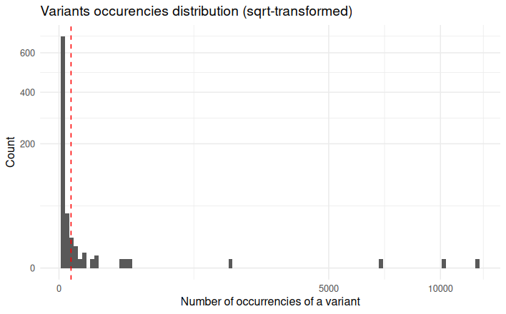
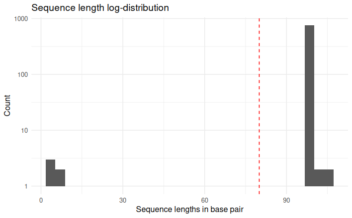

# Metabarcoding analysis tutorial

Here is a short tutorial for analyzing metabarcoding data, on an Illumina dataset from a wolf diet study, using the OBITools 4 and basic unix commands.
It presents the following analysis steps:

1. Assembly of forward and reverse reads
2. Suppression of unaligned sequence records
3. Sequence demultiplexing
4. Dereplication of sequences
5. Dataset denoising
6. Taxonomic assignation of the sequences
7. Generate the contingency table of results
8. Import the results in R

## The dataset to analyze and the reference database

The data used in this tutorial corresponds to the analysis of four wolf scats
using the protocol published in @Shehzad2012-pn for carnivore diet assessment.
After extraction of DNA from feces, DNA amplification was performed using the
primers `TTAGATACCCCACTATGC` and `TAGAACAGGCTCCTCTAG` amplifying the *12S-V5*
region [@Riaz2011-gn], together with a wolf blocking oligonucleotide.

An archive containing all the files needed for the analysis can be downloaded by clicking here: [wolf_diet_dataset](wolf_diet_dataset.tgz) 

The downloaded archive can be unarchived using the following unix command:

```bash
tar zxvf wolf_diet_dataset.tgz
```

It creates a `wolf_data` directory with the following data files:

- Two {} files resulting from the aGA IIx (Illumina) paired-end (2 x 108 bp) sequencing of DNA extracted and amplified from four wolf feces:
    - `wolf_F.fastq` with the forward sequences
    - `wolf_R.fastq` with the reverse sequences

- A tabulated file for sample demultiplexing, named `wolf_diet_ngsfilter.txt`, with primer and tag sequences for each sample.
The tags correspond to short and specific sequences added to the 5\' end of each primer to distinguish the different samples.

- The reference database in {} format named `db_v05_r117_indexed.fasta`, which has been extracted from the
from EMBL release 117 (see "build a reference database" documentation for details)

We recommend creating a new folder for the results, to separate them from the raw data:

```bash
mkdir results
```

## Recover full length sequences from forward and reverse reads

When using the result of a paired-end sequencing with supposedly overlapping forward and reverse reads,
the first step is to recover the assembled sequence.

Forward and reverse reads of the same fragment are located at the same line position in both fastqs files.
Based on these two files, the assembly of the forward and reverse reads is performed using the {} 
program, which aligns the two reads and returns the reconstructed sequence:

```bash
obipairing --min-identity=0.8 \
           --min-overlap=10 \
           -F wolf_data/wolf_F.fastq \
           -R wolf_data/wolf_R.fastq \
           > results/wolf.fastq 
```

The `--min-identity` and `--min-overlap` options allow to discard sequences with low alignment quality:
overlapping reads with less than 10 base pairs, or alignment with less than 80% similarity (identity)
produce a concatenated sequence of the two reads, with an attribute `"mode":"join"`.
Other reads that assemble well together produce sequences with the attribute `"mode":"alignment"`.
For more information, please refer to the program {}.

## Remove unaligned sequence records

Unaligned sequences, with an attribute `"mode":"join"`, cannot be used. They are removed from the dataset:

```bash
obigrep -p 'annotations.mode != "join"' \
        results/wolf.fastq > results/wolf_assembled.fastq
```

The `-p` requires a go like expression, `annotations.mode != "join"` means that
if the value of the `mode` annotation of a sequence is different from `join`,
the corresponding sequence record will be kept.

The first sequence record of `wolf_assembled.fastq` can be obtained by the command:

```bash
head -n 4 results/wolf_assembled.fastq
```
```
@HELIUM_000100422_612GNAAXX:7:108:5640:3823#0/1 {"ali_dir":"left","ali_length":62,"mode":"alignment","pairing_mismatches":{"(T:26)->(G:13)":62,"(T:34)->(G:18)":48},"paring_fast_count":53,"paring_fast_overlap":62,"paring_fast_score":0.898,"score":1826,"score_norm":0.968,"seq_a_single":46,"seq_ab_match":60,"seq_b_single":46}
ccgcctcctttagataccccactatgcttagccctaaacacaagtaattaatataacaaaattgttcgccagagtactaccggcaatagcttaaaactcaaaggacttggcggtgctttatacccttctagaggagcctgttctaaggaggcgg
+
CCCCCCCBCCCCCCCCCCCCCCCCCCCCCCBCCCCCBCCCCCCC<CcDccbe[`F`accXV=TA\RYU\\ee_e[XZ[XEEEEEEEEEE?EEEEEEEEEEDEEEEEEECCCCCCCCCCCCCCCCCCCCCCCACCCCCACCCCCCCCCCCCCCCC
```

## Assign each sequence record to the corresponding sample and marker combination

Each sequence record is assigned to its corresponding sample and marker using the data provided in the file `wolf_diet_ngsfilter.txt`.
This file follows the required format for {} program.

It contains one line per sample, with the name of the experiment (several experiments can be included in the same file),
the tags (*e.g.* `aattaac` if a same tag has been used on each extremity of the PCR products, or `aattaac:gaagtag` if two different tags were used),
the sequence of the forward primer, the sequence of the reverse primer, the letter `T` or `F` for sample identification using
the forward primer and tag only or using both primers and both tags, respectively (see {} for details).

```bash
obimultiplex -s wolf_data/wolf_diet_ngsfilter.txt \
             -u results/unidentified.fastq \
             results/wolf_assembled.fastq \
             > results/wolf_assembled_assigned.fastq
```

This command creates two files:

-   `unidentified.fastq` with the sequences that failed to be assigned to a sample/marker combination
-   `wolf_assembled_assigned.fastq` with the sequence records that were properly assigned to a sample/marker combination

Note that each sequence record of the `wolf_assembled_assigned.fastq` file
contains only the barcode sequence as the sequences of primers and tags
are removed by the {} program. Information concerning the 
experiment, sample, primers and tags is added as attributes in the 
sequence header.

For instance, the first sequence record of `wolf_assembled_assigned.fastq` is:

```
@HELIUM_000100422_612GNAAXX:7:108:5640:3823#0/1_sub[28..127] {"ali_dir":"left","ali_length":62,"experiment":"wolf_diet","mode":"alignment","obimultiplex_amplicon_rank":"1/1","obimultiplex_direction":"forward","obimultiplex_forward_error":0,"obimultiplex_forward_match":"ttagataccccactatgc","obimultiplex_forward_matching":"strict","obimultiplex_forward_primer":"ttagataccccactatgc","obimultiplex_forward_proposed_tag":"gcctcct","obimultiplex_forward_tag":"gcctcct","obimultiplex_forward_tag_dist":0,"obimultiplex_reverse_error":0,"obimultiplex_reverse_match":"tagaacaggctcctctag","obimultiplex_reverse_matching":"strict","obimultiplex_reverse_primer":"tagaacaggctcctctag","obimultiplex_reverse_proposed_tag":"gcctcct","obimultiplex_reverse_tag":"gcctcct","obimultiplex_reverse_tag_dist":0,"pairing_mismatches":{"(T:26)->(G:13)":35,"(T:34)->(G:18)":21},"paring_fast_count":53,"paring_fast_overlap":62,"paring_fast_score":0.898,"sample":"29a_F260619","score":1826,"score_norm":0.968,"seq_a_single":46,"seq_ab_match":60,"seq_b_single":46}
ttagccctaaacacaagtaattaatataacaaaattgttcgccagagtactaccggcaatagcttaaaactcaaaggacttggcggtgctttataccctt
+
CCCBCCCCCBCCCCCCC<CcDccbe[`F`accXV=TA\RYU\\ee_e[XZ[XEEEEEEEEEE?EEEEEEEEEEDEEEEEEECCCCCCCCCCCCCCCCCCC
```

## Dereplicate the sequences

A same DNA molecule can be sequenced several times. In order to reduce
both file size and computations time, and to get easier interpretable
results, it is convenient to work with unique *sequences* instead of
*reads*. To dereplicate such *reads* into unique *sequences*,
we use the `obiuniq` command.

All reads in the dataset are compared in pairs, those that are strictly identical are grouped together,
and only one copy of each sequence is kept, with frequency information in the `count` attribute.

For dereplication, we use the {} command with the `-m sample` option 
to keep the information of the original samples for each unique sequence. It returns a {} file.

```bash
obiuniq -m sample \
        results/wolf_assembled_assigned.fastq \
        > results/wolf_assembled_assigned_uniq.fasta
```

The first sequence record of `wolf_assembled_assigned_uniq.fasta` is:

```
>HELIUM_000100422_612GNAAXX:7:99:12017:19418#0/1_sub[28..127] {"ali_dir":"left","ali_length":62,"count":1,"experiment":"wolf_diet","merged_sample":{"29a_F260619":1},"mode":"alignment","obimultiplex_amplicon_rank":"1/1","obimultiplex_direction":"forward","obimultiplex_forward_error":0,"obimultiplex_forward_match":"ttagataccccactatgc","obimultiplex_forward_matching":"strict","obimultiplex_forward_primer":"ttagataccccactatgc","obimultiplex_forward_proposed_tag":"gcctcct","obimultiplex_forward_tag":"gcctcct","obimultiplex_forward_tag_dist":0,"obimultiplex_reverse_error":0,"obimultiplex_reverse_match":"tagaacaggctcctctag","obimultiplex_reverse_matching":"strict","obimultiplex_reverse_primer":"tagaacaggctcctctag","obimultiplex_reverse_proposed_tag":"gcctcct","obimultiplex_reverse_tag":"gcctcct","obimultiplex_reverse_tag_dist":0,"pairing_mismatches":{"(A:02)->(C:07)":54,"(A:02)->(G:17)":59,"(C:02)->(G:10)":42},"paring_fast_count":43,"paring_fast_overlap":62,"paring_fast_score":0.729,"sample":"29a_F260619","score":567,"score_norm":0.935,"seq_a_single":46,"seq_ab_match":58,"seq_b_single":46}
ttagccctaaacacaagtaattaatataacaaaattattcggcagagtactaccggcagt
agcttaaaactcaaaggacttggcggtgctttatacccct
```

The `obiuniq` command has added two `key:value` entries in the sequences attributes:

-   `"merged_sample":{"29a_F260619":1}`: this sequence have been found once in a single sample called "29a_F260619"
-   `"count":1` : the total count for this sequence is 1

To keep only these two attributes, we can use the {} command:

```bash
obiannotate -k count -k merged_sample \
  results/wolf_assembled_assigned_uniq.fasta \
  > results/wolf_assembled_assigned_simple.fasta
```

The first five sequence records of `wolf_assembled_assigned_simple.fasta` become:

```
>HELIUM_000100422_612GNAAXX:7:99:12017:19418#0/1_sub[28..127] {"count":1,"merged_sample":{"29a_F260619":1}}
ttagccctaaacacaagtaattaatataacaaaattattcggcagagtactaccggcagt
agcttaaaactcaaaggacttggcggtgctttatacccct
>HELIUM_000100422_612GNAAXX:7:56:19300:10949#0/1_sub[28..127] {"count":37,"merged_sample":{"29a_F260619":37}}
ttagccctaaacacaagtaattaatataacaaaattgttcaccagagtactagcggcaac
agcttaaaactcaaaggacttggcggtgctttataccctt
>HELIUM_000100422_612GNAAXX:7:117:10934:7472#0/1_sub[28..127] {"count":1,"merged_sample":{"29a_F260619":1}}
ttagccctaaacacaagtaattattataacaaaattattcgccagagtactaccggcaat
agcttaaaactcaaaggacttggcggtgctttatacccgt
>HELIUM_000100422_612GNAAXX:7:28:9432:2506#0/1_sub[28..127] {"count":4,"merged_sample":{"13a_F730603":4}}
ccagccttaaacacaaatagttatgcaaacaaaactattcgccagagtactaccggcaat
agcttaaaactcaaaggacttggcggtgctttataccctt
>HELIUM_000100422_612GNAAXX:7:94:11447:14902#0/1_sub[28..127] {"count":1,"merged_sample":{"15a_F730814":1}}
ttagccctaaacacaagtaattagtataacaaaattattccccagagtactaccggcaat
agcttaaaactcaaaggacttggcggtgctttataccctt
```

## Denoise the sequence dataset

To have a set of sequences assigned to their corresponding samples does
not mean that all sequences are *biologically* meaningful, *i.e.* some of
these sequences can contains PCR and/or sequencing errors, or chimeras.

#### Tag the sequences for PCR errors (sequence variants) {.unnumbered}

The {} program tags sequence variants as potential error generated during
PCR amplification. We ask it to keep the cluster-head sequences (`-H` option) that are sequences which
are not variants of another sequence with a count greater than 5% of their own count
(`-r 0.05` option). See the {} documentation for details.

```bash
obiclean -s sample -r 0.05 -H \
         results/wolf_assembled_assigned_simple.fasta \
         > results/wolf_assembled_assigned_simple_clean.fasta
```

One of the sequence records of `wolf_assembled_assigned_simple_clean.fasta` is:

```
>HELIUM_000100422_612GNAAXX:7:56:19300:10949#0/1_sub[28..127] {"count":37,"merged_sample":{"29a_F260619":37},"obiclean_head":true,"obiclean_headcount":1,"obiclean_internalcount":0,"obiclean_samplecount":1,"obiclean_singletoncount":0,"obiclean_status":{"29a_F260619":"h"},"obiclean_weight":{"29a_F260619":43}}
ttagccctaaacacaagtaattaatataacaaaattgttcaccagagtactagcggcaac
agcttaaaactcaaaggacttggcggtgctttataccctt
```

To remove potential chimeric sequences, or amplification or sequencing errors (artifacts),
we discard the rare sequence variants.

#### Get some statistics about the sequence counts {.unnumbered}

```bash
obicount results/wolf_assembled_assigned_simple_clean.fasta
```
```
entities,n
variants,765
reads,33823
symbols,75668
```

The dataset contains 765 sequence variants corresponding to 33823 sequence reads.
Most of the variants occur only a single time in the complete dataset and are usually
named *singletons*, let us see how many singletons there are:

```bash
obigrep -p 'sequence.Count() == 1' \
        results/wolf_assembled_assigned_simple_clean.fasta |\
        obicount
```
```
entities,n
variants,649
reads,649
symbols,64497
```

In our dataset, there are 649 singletons (or variants).

Using *R* and the `ROBIFastread` package able to read headers of the fasta files produced by *OBITools*,
we can get more complete statistics on the sqrt-transformed distribution of occurrencies.

```r
# Import libraries
library(ROBIFastread)
library(ggplot2)

# Import the fasta file
seqs <- read_obifasta("results/wolf_assembled_assigned_simple_clean.fasta", keys="count")

# Plot occurencies
ggplot(data=seqs, mapping=aes(x=count)) +
  geom_histogram(bins=100) +
  scale_y_sqrt() +
  scale_x_sqrt() +
  geom_vline(xintercept=10, col="red", lty=2) +
  xlab("Number of occurrencies of a variant") +
  ylab("Count") +
  ggtitle("Variants occurencies distribution (sqrt-transformed)") +
  theme_minimal()
```


The red dotted vertical line is placed at the level of variants that appear exactly 10 times (count=10).
This represents the threshold at which we wish to retain sequence variants.
Below this threshold, we consider that the variant is not abundant enough in the dataset to be considered
a true sequence, but a potential artifact because it is too rare. 
Singletons correspond to variants whose count is 1.

In a similar way, it is also possible to plot the distribution of the sequence length.

```r
ggplot(data=seqs, mapping=aes(x=nchar(sequence))) +
  geom_histogram() +
  scale_y_log10() +
  geom_vline(xintercept = 80, col="red", lty=2) +
  xlab("Sequence lengths in base pair") +
  ylab("Count") +
  ggtitle("Sequence length log-distribution") +
  theme_minimal()
```


The red dotted vertical line represents the threshold at 80 bp, above which we wish to keep the sequences, 
otherwise considered too short so as potential artefacts.

#### Keep only the sequences having a count greater or equal to 10 and a length shorter than 80 bp  {.unnumbered}

Based on the previous observation, first we set a threshold to keep only the sequences that appear at least 10 times (count ≥ 10),
thanks to {}.

The `-p` option means that the python expression `count>=10` must be evaluated to 
`True` for each sequence to be kept, and the `-l` option allows us to remove sequences
shorter than 80 bp, as we know that the amplified 12S-V5 barcode for vertebrates must have a length around 100 bp.

```bash
obigrep -l 80 \
        -p 'sequence.Count() >= 10' \
        results/wolf_assembled_assigned_simple_clean.fasta \
        > results/wolf_assembled_assigned_simple_clean_c10l80.fasta
```

The first sequence record of `results/wolf_assembled_assigned_simple_clean_c10l80.fasta` is:
 
```
>HELIUM_000100422_612GNAAXX:7:56:19300:10949#0/1_sub[28..127] {"count":37,"merged_sample":{"29a_F260619":37},"obiclean_head":true,"obiclean_headcount":1,"obiclean_internalcount":0,"obiclean_samplecount":1,"obiclean_singletoncount":0,"obiclean_status":{"29a_F260619":"h"},"obiclean_weight":{"29a_F260619":43}}
ttagccctaaacacaagtaattaatataacaaaattgttcaccagagtactagcggcaac
agcttaaaactcaaaggacttggcggtgctttataccctt
```

Count the sequences after these filtering steps:

```bash
obicount results/wolf_assembled_assigned_simple_clean_c10l80.fasta
```
```
entities,n
variants,25
reads,30816
symbols,2486
```

## Taxonomic assignment of sequences

Once denoising has been done, the next step in diet analysis is to
assign the barcodes to the corresponding taxa (species, genus, etc.),
in order to get the complete list of the taxa associated to each sample.
The taxonomic assignment of sequences requires a reference database to
detect all possible taxa to be identified in samples.
It is then based on sequence comparison between sample
sequences and reference sequences.

#### Download the taxonomy  {.unnumbered}

The current and complete taxonomy from the NCBI is available online,
it is possible to download it with the following command:

```bash
curl http://ftp.ncbi.nih.gov/pub/taxonomy/taxdump.tar.gz > taxdump.tar.gz
```

A copy of this `taxdump.tar.gz` file is also available into the tutorial archive.
Note that the NCBI taxonomy is daily updated, but this version is correct to use.

#### Assign the sequences {.unnumbered}

Thanks to the reference database, taxonomic assignment can be
carried out with {}:

```bash
obitag -t wolf_data/taxdump.tar.gz \
       -R wolf_data/db_v05_r117_indexed.fasta \
       results/wolf_assembled_assigned_simple_clean_c10l80.fasta \
       > results/wolf_assembled_assigned_simple_clean_c10l80_taxo.fasta
```

The first sequence record of `wolf_assembled_assigned_simple_clean_c10l80_taxo.fasta` is:

```
>HELIUM_000100422_612GNAAXX:7:56:19300:10949#0/1_sub[28..127] {"count":37,"merged_sample":{"29a_F260619":37},"obiclean_head":true,"obiclean_headcount":1,"obiclean_internalcount":0,"obiclean_samplecount":1,"obiclean_singletoncount":0,"obiclean_status":{"29a_F260619":"h"},"obiclean_weight":{"29a_F260619":43},"obitag_bestid":0.96,"obitag_bestmatch":"AJ885202","obitag_match_count":1,"obitag_rank":"NA","obitag_similarity_method":"lcs","taxid":"NA"}
ttagccctaaacacaagtaattaatataacaaaattgttcaccagagtactagcggcaac
agcttaaaactcaaaggacttggcggtgctttataccctt
```

The {} command adds several attributes in the sequence record header, like:

- `obitag_bestmatch:ACCESSION` where ACCESSION is the id of hte sequence in
the reference database that best aligns to the query sequence
- `obitag_bestid:FLOAT` where FLOAT\*100 is the identity percent between
the best match sequence and the query sequence
- `taxid:TAXID` where TAXID is the final taxonomy ID assigned to the sequence by {}
- `scientific_name:NAME` where NAME is the scientific name of the assigned taxid

## Generate the contingency table of results

Some useless attributes can be removed at this stage with {}:

```bash
obiannotate  --delete-tag=obiclean_head \
             --delete-tag=obiclean_headcount \
             --delete-tag=obiclean_internalcount \
             --delete-tag=obiclean_samplecount \
             --delete-tag=obiclean_singletoncount \
             results/wolf_assembled_assigned_simple_clean_c10l80_taxo.fasta \
             > results/wolf_final.fasta
```

The first sequence record of `wolf_final.fasta` is then:
 
``` 
>HELIUM_000100422_612GNAAXX:7:56:19300:10949#0/1_sub[28..127] {"count":37,"merged_sample":{"29a_F260619":37},"obiclean_status":{"29a_F260619":"h"},"obiclean_weight":{"29a_F260619":43},"obitag_bestid":0.96,"obitag_bestmatch":"AJ885202","obitag_match_count":1,"obitag_rank":"NA","obitag_similarity_method":"lcs","taxid":"NA"}
ttagccctaaacacaagtaattaatataacaaaattgttcaccagagtactagcggcaac
agcttaaaactcaaaggacttggcggtgctttataccctt
```

## Looking at the data in R

The results can be imported in *R*.

```r
# Import libraries
library(ROBIFastread)
library(vegan)
library(magrittr)

# Import the results
diet_data <- read_obifasta("results/wolf_final.fasta") 
diet_data %<>% extract_features("obitag_bestmatch", "obitag_rank", "scientific_name", "taxid")

# Extract count matrix
diet_tab <- extract_readcount(diet_data,key="obiclean_weight")
diet_tab
```

There are 25 final annotated sequences.
We can make the following assumptions about wolf diet, based on our samples:
- 13a_F730603 sample: *Cervus elaphus*
- 15a_F730814 sample: *Capreolus capreolus*
- 26a_F040644 sample: *Marmota sp.* (according to the location, it is *Marmota marmota*)
- 29a_F260619 sample: *Capreolus capreolus*

Note that we also obtained a few wolf sequences although a wolf-blocking oligonucleotide was used.